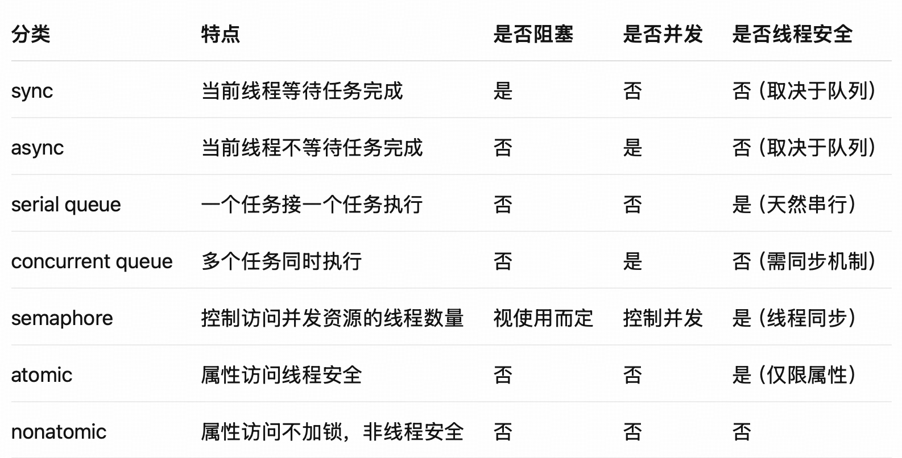

# 多线程
## 一、同步（Synchronous）与异步（Asynchronous）任务
1. 同步（sync）：
	•	特点：当前线程发起任务后，等待任务执行完成再继续执行后续代码。
	•	常用于：需要按顺序执行的任务，不适用于耗时操作（会阻塞主线程）。
    ```
    DispatchQueue.global().sync {
        print("同步任务")
    }
    ```
2. 异步（async）：
	•	特点：当前线程发起任务后，不等待任务执行完成，继续执行后续代码。
	•	常用于：不会阻塞当前线程，适合耗时操作或后台任务。
    ```
    DispatchQueue.global().async {
        print("异步任务")
    }
    ```
## 二、串行队列（Serial Queue）与并行队列（Concurrent Queue）
1. 串行队列：
	•	特点：一个任务执行完再执行下一个任务。
	•	使用场景：顺序要求高，或多个任务需要排队避免数据冲突。
    ```
    let serialQueue = DispatchQueue(label: "com.example.serial")
    serialQueue.async {
        // 任务1
    }
    serialQueue.async {
        // 任务2，等任务1执行完再执行
    }
    ```
2. 并行队列：
	•	特点：可以同时执行多个任务，任务之间独立。
	•	使用场景：提升执行效率，如加载多个图片、并发网络请求。
    ```
    let concurrentQueue = DispatchQueue(label: "com.example.concurrent", attributes: .concurrent)
    concurrentQueue.async {
        // 任务1
    }
    concurrentQueue.async {
        // 任务2，可能与任务1并发执行
    }
    ```
Apple 提供的主队列和全局并发队列：

```
let mainQueue = DispatchQueue.main      // 主线程串行队列
let globalQueue = DispatchQueue.global() // 全局并发队列
```
## 三、信号量（Semaphore）
功能：用于控制访问共享资源的线程数量（可用于线程同步、限流）
使用场景：
	•	控制最大并发数（如最多同时处理 3 个任务）
	•	实现同步等待异步操作完成

示例：限制最多3个任务同时执行

```
let semaphore = DispatchSemaphore(value: 3)
let queue = DispatchQueue.global()

for i in 0..<10 {
    queue.async {
        semaphore.wait() // 减1，若为负数则等待
        print("执行任务 \(i)")
        sleep(2)
        semaphore.signal() // 加1，释放信号
    }
}
```

示例：将异步任务变为同步等待

```
let semaphore = DispatchSemaphore(value: 0)
var result: String?

DispatchQueue.global().async {
    result = "异步任务完成"
    semaphore.signal()
}

semaphore.wait() // 等待任务完成
print(result!)
```
## 四、LRU 缓存策略（Least Recently Used）
原理：
	•	保留最近最常访问的内容，淘汰最久未使用的数据。
	•	可用 Dictionary + Double Linked List 实现，时间复杂度为 O(1)。

Swift 实现简化版（用 NSCache 也能实现 LRU）：

```
class LRUCache<Key: Hashable, Value> {
    private var capacity: Int
    private var cache: [Key: Value] = [:]
    private var keys: [Key] = []

    init(capacity: Int) {
        self.capacity = capacity
    }

    func get(_ key: Key) -> Value? {
        if let value = cache[key] {
            moveToTop(key)
            return value
        }
        return nil
    }

    func put(_ key: Key, value: Value) {
        if cache[key] != nil {
            moveToTop(key)
        } else {
            if keys.count >= capacity {
                let removed = keys.removeFirst()
                cache.removeValue(forKey: removed)
            }
            keys.append(key)
        }
        cache[key] = value
    }

    private func moveToTop(_ key: Key) {
        keys.removeAll { $0 == key }
        keys.append(key)
    }
}
```

## 五、atomic 与 nonatomic 的区别（Objective-C）

atomic（原子性）：
	•	保证 getter/setter 的线程安全，通过加锁实现。
	•	不能保证多个操作的整体线程安全。

```
@property (atomic, strong) NSString *name;
```

适合对性能要求不高且访问频率低的属性。

nonatomic：
	•	不加锁，性能更高，但不保证线程安全。

```
@property (nonatomic, strong) NSString *name;
```

大多数情况推荐使用 nonatomic，线程安全应通过更高级机制保障（如 GCD、锁）。

总结对比表：

下面是关于「同步 vs 异步」「串行 vs 并行队列」结合的高质量面试题，适合 iOS 面试深入考察多线程理解，附有答案与解析，供你深入掌握。
## 六、选择题（理解基础）
以下哪种组合会造成线程阻塞？
A. DispatchQueue.global().async
B. DispatchQueue.main.async
C. DispatchQueue.global().sync
D. DispatchQueue.main.sync

正确答案：D

✅ 解析：
	•	sync 表示同步执行，会阻塞当前线程。
	•	DispatchQueue.main.sync 如果当前就是主线程，会造成死锁（主线程等待自己）。
## 七、编程题（代码理解）
输出顺序？
```
print("1")
DispatchQueue.global().async {
    print("2")
    DispatchQueue.main.sync {
        print("3")
    }
    print("4")
}
print("5")
```
这段代码会导致死锁，实际输出为：1->5->2，然后程序会卡住，不会继续执行。

1. 详细解释
    1. 首先在主线程执行 print("1")
    2. 然后在全局队列（后台线程）异步执行一个闭包
    3. 主线程继续执行，打印 print("5")
    4. 后台线程开始执行，打印 print("2")
    5. 后台线程尝试在主线程同步执行 print("3") ，这里使用了 sync
    6. 死锁发生 ：后台线程等待主线程完成任务，但主线程已经完成了 print("5") 并等待整个程序执行完毕，而后台线程的任务需要主线程执行 print("3") 才能继续，形成了相互等待的死锁
2. 死锁原因
这是一个典型的线程死锁场景：
- 后台线程通过 DispatchQueue.main.sync 尝试同步执行代码在主线程上
- 主线程已经完成了自己的工作，但需要等待所有后台任务完成
- 后台任务需要主线程执行代码才能继续
- 结果双方都在等待对方，导致死锁
3. 如何避免
要避免这种死锁，可以将 sync 改为 async ：
```
print("1") 
DispatchQueue.global().async { 
    print("2") 
    DispatchQueue.main.async { 
        print("3") 
    } 
    print("4") 
} 
print("5")
```
这样修改后的输出顺序会是： 1 , 5 , 2 , 4 , 3 （因为主队列的异步任务会在当前执行循环结束后才执行）。

## 八、死锁题（考察陷阱）
下列代码是否会死锁？

```
DispatchQueue.main.async {
    print("A")
    DispatchQueue.main.sync {
        print("B")
    }
    print("C")
}
```
答案：会死锁
✅ 解析：
	•	外层是异步放入主队列：表示稍后在主线程中执行
	•	但内层是 sync 同步放入主队列
	•	造成主线程在等待自己完成 => 死锁
	•	在 GCD 中，永远不要在某个队列的任务中，再使用 sync 方法在同一个队列上执行任务，这必然会导致死锁。

## 九、模拟题（手写输出分析）
输出顺序？
```
let queue = DispatchQueue(label: "serialQueue")

queue.async {
    print("1")
    queue.sync {
        print("2")
    }
    print("3")
}
```
结果：死锁

✅ 解析：
	•	串行队列内部再 sync 调用自身任务 => 当前任务未完成就等待自己 => 死锁
	•	⚠️ GCD 的串行队列禁止这种“同步嵌套自身”的写法

## 十、设计题（场景落地）
如何使用 GCD 保证多个异步任务执行顺序？

比如：图片上传，必须按顺序上传 A → B → C，且都在后台线程。

✅ 答案：

使用自定义串行队列 + async：

```
let serialQueue = DispatchQueue(label: "com.example.upload")

serialQueue.async {
    upload(image: A)
}
serialQueue.async {
    upload(image: B)
}
serialQueue.async {
    upload(image: C)
}
```
•	虽然是异步提交，但串行队列会确保顺序执行。
•	所有任务仍在后台线程运行，不会阻塞主线程。

## 十一、知识延展题

sync 放入 concurrent queue，会并发执行吗？

```
let queue = DispatchQueue(label: "concurrent", attributes: .concurrent)

queue.sync {
    print("任务1")
}
queue.sync {
    print("任务2")
}

```
答案：不会并发，顺序执行

✅ 解析：
	•	sync 会阻塞当前线程直到任务完成
	•	即使 queue 是并发的，调用是同步的，也必须一个个来
	•	想要并发，必须使用 async

## 十二、场景题（综合应用）

如何实现：最多并发执行 3 个网络请求，全部完成后更新 UI？

✅ 答案（使用信号量 + DispatchGroup）：

```
let group = DispatchGroup()
let semaphore = DispatchSemaphore(value: 3)

for url in urls {
    DispatchQueue.global().async(group: group) {
        semaphore.wait()
        performNetworkRequest(url: url)
        semaphore.signal()
    }
}

group.notify(queue: .main) {
    updateUI()
}

```
•	信号量控制最多并发数为 3
•	DispatchGroup 监听所有任务是否完成
•	主线程更新 UI

## 十三、任务：面试官进阶提问

问：你怎么判断是否需要使用并发队列？哪种情况更适合串行队列？

✅ 答题建议：
* 并发队列适合：
    * 	多个任务之间无依赖，可并发提升效率
    * 	如多个图片下载、独立 API 请求
*	串行队列适合：
	*	保证任务顺序执行（例如：数据库操作、顺序上传）
	*	避免资源访问冲突（例如：文件写入）